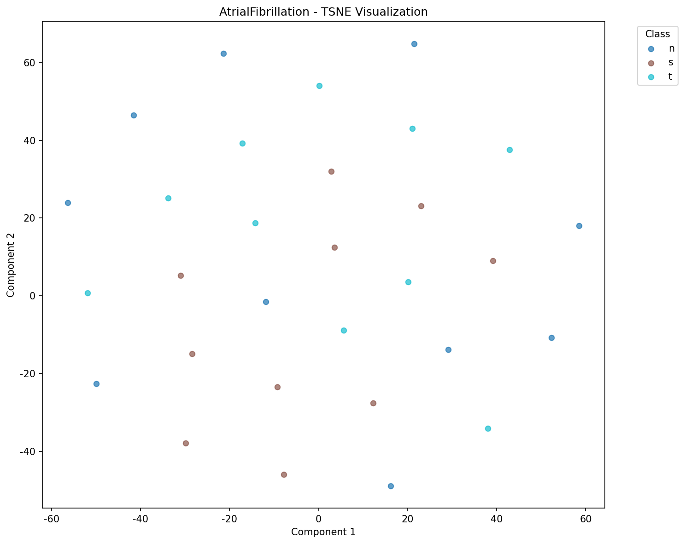
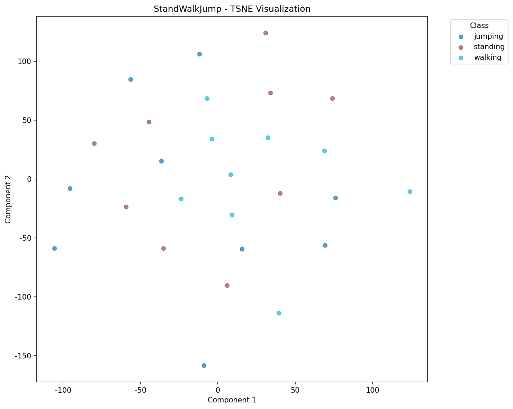
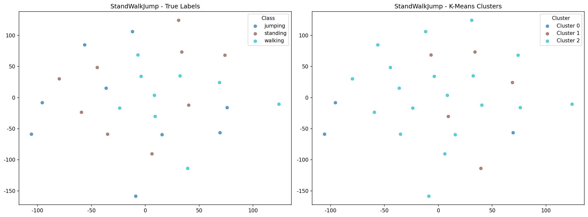
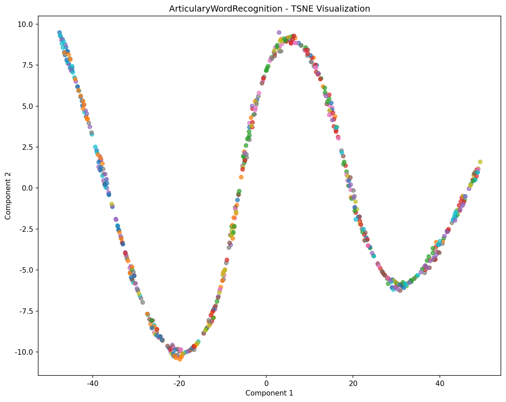
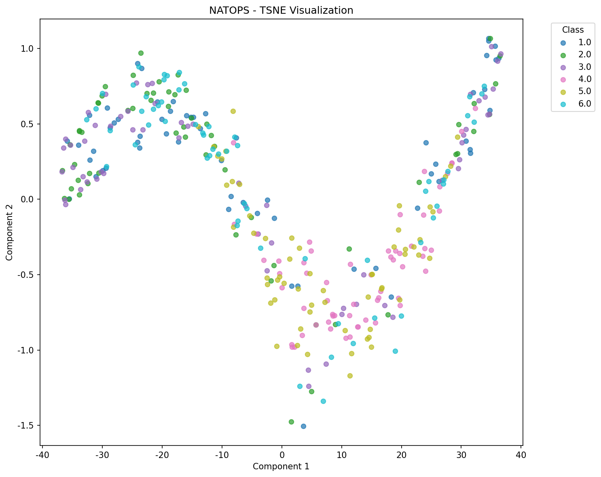
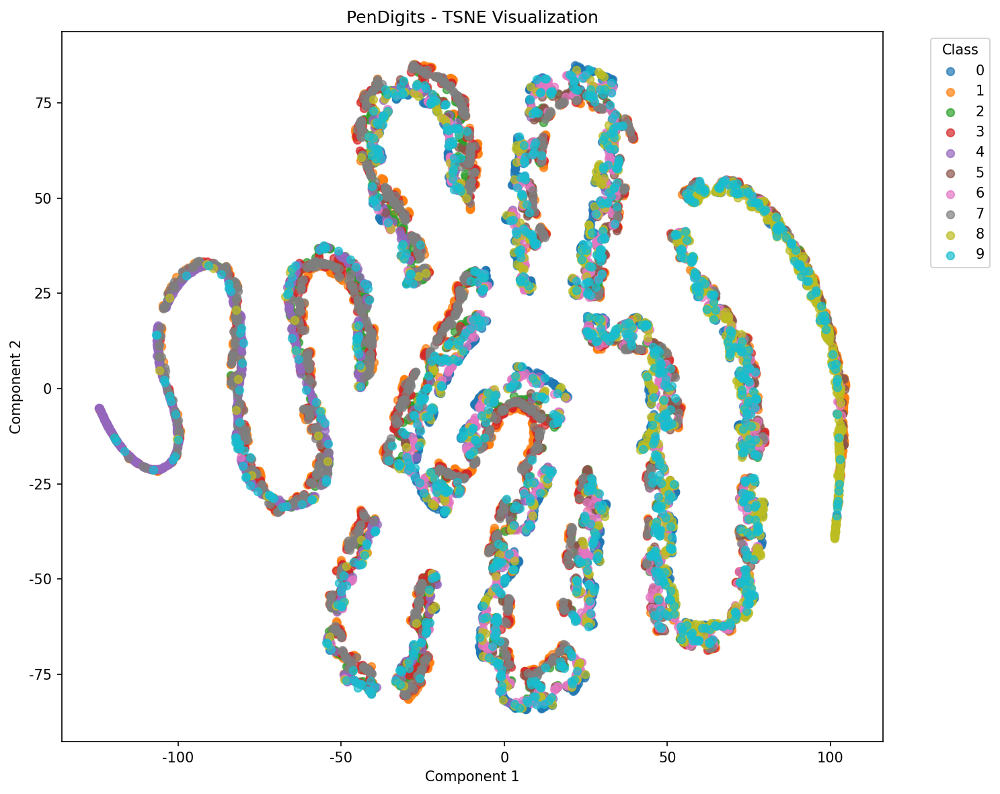
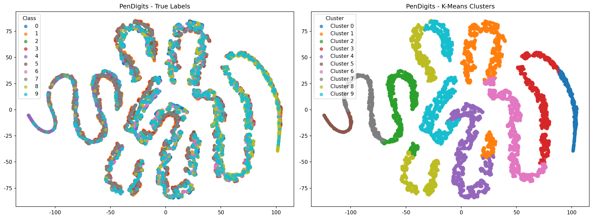
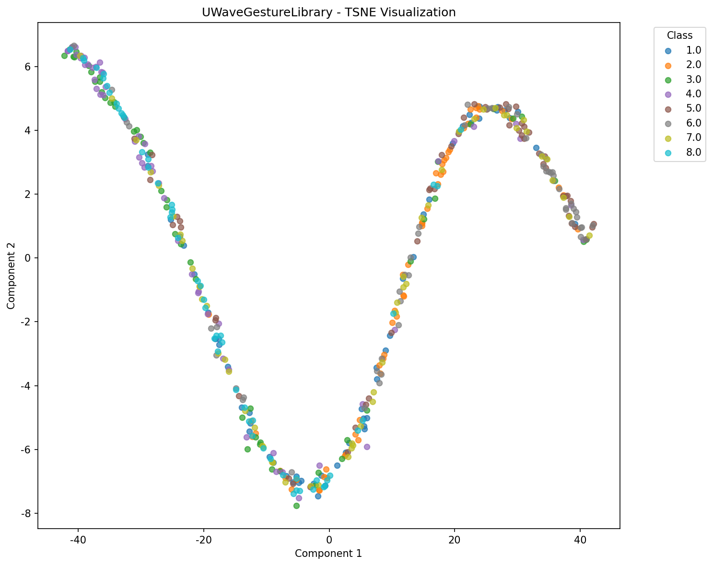
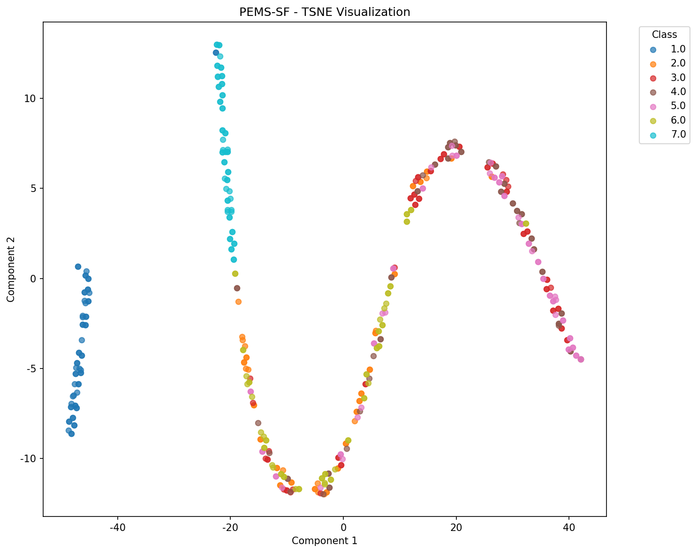

# Merit 다운스트림 태스크 평가 결과

생성 시간: 2025-11-30 21:43:39

## 1. Classification 결과

| Dataset | Accuracy | F1 (Macro) | F1 (Weighted) | CV Accuracy | Classes |
|---------|----------|------------|---------------|-------------|---------|
| AtrialFibrillation | 0.1667 | 0.1111 | 0.1111 | 0.4000±0.1700 | 3 |
| StandWalkJump | 0.5000 | 0.5222 | 0.5222 | 0.4400±0.1356 | 3 |
| ArticularyWordRecognition | 0.2174 | 0.1604 | 0.1576 | 0.1913±0.0343 | 25 |
| NATOPS | 0.2639 | 0.2437 | 0.2437 | 0.2917±0.0291 | 6 |
| PenDigits | 0.5121 | 0.4699 | 0.4743 | 0.4972±0.0164 | 10 |
| UWaveGestureLibrary | 0.2727 | 0.2282 | 0.2282 | 0.2773±0.0423 | 8 |

### Classification 방법론 비교 (Accuracy)

| Dataset | SVM | KNN | Random Forest |
|---------|-----|-----|---------------|
| AtrialFibrillation | 0.1667 | 0.3333 | 0.0000 |
| StandWalkJump | 0.5000 | 0.5000 | 0.5000 |
| ArticularyWordRecognition | 0.2174 | 0.1913 | 0.2348 |
| NATOPS | 0.2639 | 0.2917 | 0.2917 |
| PenDigits | 0.5121 | 0.6003 | 0.6166 |
| UWaveGestureLibrary | 0.2727 | 0.1932 | 0.2273 |

## 2. Clustering 결과

| Dataset | NMI | RI | ARI | Silhouette | Clusters |
|---------|-----|-----|-----|------------|----------|
| StandWalkJump | 0.2589 | 0.5214 | 0.0602 | 0.6073 | 3 |
| PenDigits | 0.1415 | 0.8195 | 0.0589 | 0.3885 | 10 |

## 3. Anomaly Detection 결과

| Dataset | Method | Accuracy | Precision | Recall | F1 | ROC-AUC |
|---------|--------|----------|-----------|--------|-----|---------|
| AtrialFibrillation | Isolation Forest | 0.8000 | 0.7500 | 0.6000 | 0.6667 | 0.8325 |
| AtrialFibrillation | One-Class SVM | 0.7667 | 0.6667 | 0.6000 | 0.6316 | 0.7250 |
| StandWalkJump | Isolation Forest | 0.7407 | 0.6667 | 0.4444 | 0.5333 | 0.7191 |
| StandWalkJump | One-Class SVM | 0.8148 | 0.7500 | 0.6667 | 0.7059 | 0.7840 |
| PEMS-SF | Isolation Forest | 0.8045 | 0.2041 | 0.1754 | 0.1887 | 0.4552 |
| PEMS-SF | One-Class SVM | 0.8000 | 0.1702 | 0.1404 | 0.1538 | 0.5895 |

## 4. Forecasting 결과

| Dataset | MSE | RMSE | MAE | R² |
|---------|-----|------|-----|-----|
| AtrialFibrillation | 0.6727 | 0.8202 | 0.6033 | -0.5789 |
| PEMS-SF | 1.0313 | 1.0155 | 0.8465 | 0.0224 |

## 5. Imputation 결과

| Dataset | MSE | RMSE | MAE | Mask Ratio |
|---------|-----|------|-----|------------|
| PEMS-SF | 0.0293 | 0.1713 | 0.1414 | 0.20 |

## 6. Representation 시각화

### AtrialFibrillation

### StandWalkJump

### ArticularyWordRecognition

### NATOPS

### PenDigits

### UWaveGestureLibrary

### PEMS-SF

## 7. 요약

- **Classification 평균 Accuracy**: 0.3221

- **Clustering 평균 NMI**: 0.2002

---

*Generated by Merit Downstream Evaluation Pipeline*
